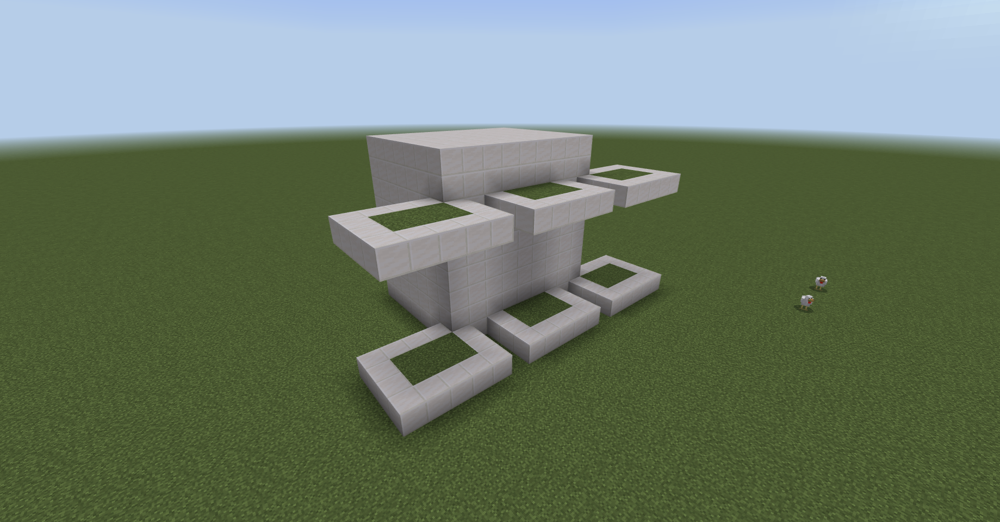

# ⭐️Домашнє завдання⭐️

1. Заповнити піраміду повітрям всередині
2. Змінити напрям побудови трикутника
3. Навколо піраміди з кожної сторони додати трикутники (як фонтани навколо Лувра)
4. Зробити кодом власну версію багаторівневої клумби

<figure><figcaption></figcaption></figure>
